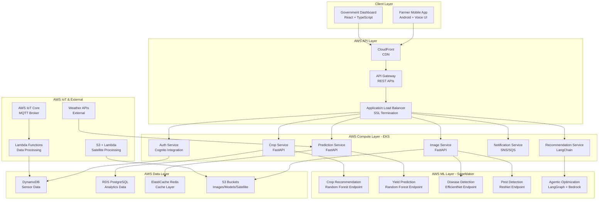
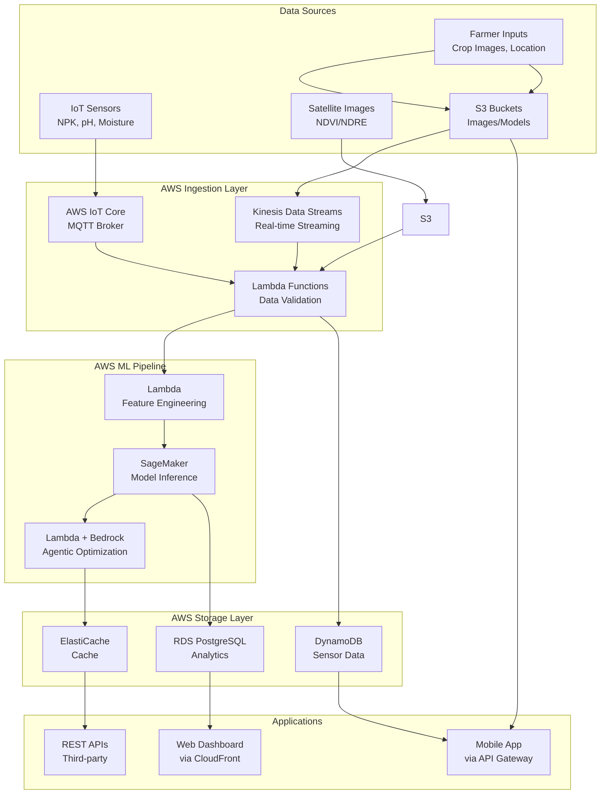
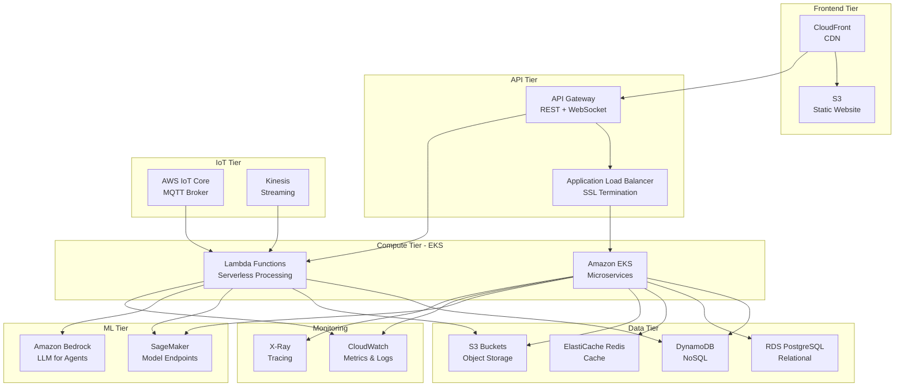

# System Design Document
## AgriMitra - Smart Agriculture Platform

**Version:** 1.0  
**Date:** February 5, 2026  
**Cloud Platform:** Amazon Web Services (AWS)

---

## 1. High-Level Architecture Overview

AgriMitra uses **microservices architecture** with event-driven design on AWS cloud-native services.

**Core Principles**: API-first design, containerized microservices (EKS), multi-tenant SaaS, edge computing for offline mobile

**Technology Stack**:
- **Frontend**: React (Gov Dashboard), Android (Farmer App)
- **Backend**: Python FastAPI, Node.js Express
- **ML/AI**: TensorFlow, Scikit-learn, LangChain, LangGraph, Amazon Bedrock
- **Database**: DynamoDB, RDS PostgreSQL, ElastiCache Redis
- **Cloud**: AWS (EKS, Lambda, S3, SageMaker, IoT Core, API Gateway)
- **IoT**: Arduino + LoRaWAN, ESP32
- **Satellite**: Google Earth Engine + S3

---

## 2. System Component Diagram



---

## 3. Data Flow Diagram



---

## 4. Module-wise Design

### 4.1 Farmer Mobile App (Android)

**Architecture**: MVVM with Repository Pattern

**Core Features**:
- Authentication (AWS Cognito)
- Crop Recommendation (SageMaker ML)
- Disease/Pest Detection (On-device TensorFlow Lite + Cloud CNN)
- Yield Prediction (API calls)
- Market Prices, Community Chat, Voice Assistant (Multilingual TTS/STT)
- Fertilizer Scanner (Barcode validation)

**Tech Stack**: Java/Kotlin, Material Design, TensorFlow Lite (50MB models), SQLite + Firebase, Retrofit + OkHttp

### 4.2 Backend Services (Python/Node.js on AWS EKS)

**Microservices**:

**Crop Service (FastAPI)**:
```python
POST /api/crops/recommend        # SageMaker endpoint
POST /api/crops/predict-yield    # SageMaker endpoint
GET /api/crops/market-prices     # ElastiCache cached
GET /api/crops/advisory          # RDS query
```

**Image Processing Service (FastAPI)**:
```python
POST /api/images/detect-disease  # S3 → Lambda → SageMaker
POST /api/images/detect-pest     # S3 → Lambda → SageMaker
GET /api/images/history          # DynamoDB query
```

**IoT Data Service (Lambda + Node.js)**:
```javascript
POST /api/sensors/data           # IoT Core → Lambda → DynamoDB
GET /api/sensors/latest          # DynamoDB query
WebSocket /ws/sensors/live       # API Gateway WebSocket
```

**Recommendation Service (Lambda + LangChain)**:
```python
POST /api/recommendations/fertilizer   # Lambda → Bedrock → DynamoDB
POST /api/recommendations/irrigation   # Lambda → Bedrock
GET /api/recommendations/history       # DynamoDB query
```

### 4.3 Government Dashboard (React + TypeScript)

**Modules**: Authentication (OAuth 2.0), Farmer Management, Analytics Dashboard, Pest Tracking (Leaflet maps), Yield Analysis, Scheme Management, Alert System, Report Generation

**Tech Stack**: React 18 + Vite, Redux Toolkit, Material-UI + Tailwind CSS, Chart.js + D3.js, Leaflet + OpenStreetMap

---

## 5. ML/DL Integration Design

### 5.1 Model Specifications

**Crop Recommendation (Random Forest)**:
- Input: [N, P, K, pH, temperature, humidity, rainfall]
- Output: 22 crop types
- Size: 15MB | Accuracy: 99.55% | Inference: <100ms

**Disease Detection (EfficientNet-B0)**:
- Input: 224x224x3 RGB images
- Classes: 22 disease types across 4 crops
- Size: 45MB (mobile: 20MB quantized) | Accuracy: 89.17% | Inference: <2s (mobile: <5s)

**Pest Detection (ResNet-50)**:
- Input: 224x224x3 RGB images
- Classes: 19 pest types across 4 crops
- Size: 38MB | Accuracy: 64.4% | Inference: <3s

**Yield Prediction (Ensemble)**:
- Models: Random Forest, XGBoost, LightGBM
- Features: Soil + Weather + Historical + Satellite
- Output: Yield (quintals/hectare) + confidence interval
- Size: 25MB | MAE: ±15%

### 5.2 Agentic AI System (LangChain + LangGraph)

```python
class AgricultureAgent:
    def __init__(self):
        self.llm = ChatGoogleGenerativeAI(model="gemini-2.5-flash")
        self.knowledge_base = CropKnowledgeBase()
        self.tools = [SoilAnalysisTool(), WeatherTool(), 
                      CropRecommendationTool(), FertilizerOptimizationTool()]
    
    def optimize_farming_plan(self, farmer_data):
        workflow = StateGraph(AgentState)
        workflow.add_node("analyze_soil", self.analyze_soil)
        workflow.add_node("check_weather", self.check_weather)
        workflow.add_node("recommend_crops", self.recommend_crops)
        workflow.add_node("optimize_inputs", self.optimize_inputs)
        return workflow.invoke(farmer_data)
```

### 5.3 Model Deployment (AWS SageMaker)

**SageMaker Endpoints**: Real-time inference with auto-scaling
**Configuration**:
```python
endpoint_config = {
    'EndpointName': 'crop-recommendation-prod',
    'InstanceType': 'ml.m5.xlarge',
    'InitialInstanceCount': 2,
    'AutoScaling': {
        'MinCapacity': 2,
        'MaxCapacity': 10,
        'TargetValue': 70.0  # Target invocations per instance
    }
}
```

**Edge Deployment**: TensorFlow Lite with INT8 quantization, models distributed via S3, offline inference cached locally

---

## 6. IoT and Satellite Integration

### 6.1 IoT Architecture (AWS IoT Core)

**Sensor Network**:
- NPK Sensor (0-999 ppm), pH Sensor (0-14), Soil Moisture (0-100%)
- Temperature (-40°C to 85°C), Humidity (0-100%)
- Solar Panel + Battery (7-day backup)

**Data Flow**: Sensor Nodes (Arduino + LoRa) → LoRaWAN Gateway (Raspberry Pi) → AWS IoT Core (MQTT) → IoT Rules Engine → Lambda → DynamoDB

**IoT Data Processing (Lambda)**:
```python
import boto3, json

dynamodb = boto3.resource('dynamodb')
sns = boto3.client('sns')
sagemaker = boto3.client('sagemaker-runtime')

def lambda_handler(event, context):
    data = json.loads(event['body'])
    validated_data = validate_sensor_readings(data)
    
    if detect_anomaly(validated_data):
        sns.publish(TopicArn='arn:aws:sns:ap-south-1:xxx:sensor-alerts',
                    Message=json.dumps(validated_data))
    
    table = dynamodb.Table('SensorData')
    table.put_item(Item=validated_data)
    
    if should_predict(validated_data):
        response = sagemaker.invoke_endpoint(
            EndpointName='crop-recommendation-prod',
            Body=json.dumps(validated_data))
    
    return {'statusCode': 200, 'body': 'Processed'}
```

### 6.2 Satellite Integration (Google Earth Engine + AWS)

**NDVI/NDRE Processing (Lambda + S3)**:
```python
import ee, boto3

s3 = boto3.client('s3')

def lambda_handler(event, context):
    ee.Initialize()
    region = ee.Geometry.Rectangle(event['bounds'])
    
    collection = ee.ImageCollection('COPERNICUS/S2_SR') \
        .filterBounds(region) \
        .filterDate(event['start_date'], event['end_date']) \
        .filter(ee.Filter.lt('CLOUDY_PIXEL_PERCENTAGE', 20))
    
    def add_ndvi(image):
        return image.addBands(image.normalizedDifference(['B8', 'B4']).rename('NDVI'))
    
    def add_ndre(image):
        return image.addBands(image.normalizedDifference(['B8', 'B5']).rename('NDRE'))
    
    processed = collection.map(add_ndvi).map(add_ndre).median()
    
    task = ee.batch.Export.image.toCloudStorage(
        image=processed, bucket='agrimitra-satellite',
        fileNamePrefix=f'ndvi_ndre_{event["field_id"]}', scale=10)
    task.start()
    
    return {'statusCode': 200, 'taskId': task.id}
```

**Crop Health Analysis (SageMaker)**:
```python
def classify_growth_stage(field_id):
    ndvi_data = s3.get_object(Bucket='agrimitra-satellite',
                               Key=f'ndvi_ndre_{field_id}/ndvi.tif')
    features = preprocess_satellite_data(ndvi_data)
    
    response = sagemaker.invoke_endpoint(
        EndpointName='crop-stage-classifier',
        ContentType='application/json',
        Body=json.dumps({'features': features.tolist()}))
    
    result = json.loads(response['Body'].read())
    stages = ['Vegetative', 'Tuber Initiation', 'Bulking', 'Maturation']
    return {'stage': stages[result['predicted_class']], 
            'confidence': result['confidence']}
```

---

## 7. AWS Deployment Architecture

### 7.1 AWS Services Overview



### 7.2 EKS Configuration

**Deployment**:
```yaml
apiVersion: apps/v1
kind: Deployment
metadata:
  name: crop-service
  namespace: agrimitra-prod
spec:
  replicas: 3
  template:
    spec:
      containers:
      - name: crop-service
        image: 123456789012.dkr.ecr.ap-south-1.amazonaws.com/crop-service:v1.0
        ports:
        - containerPort: 8000
        resources:
          requests: {memory: "512Mi", cpu: "250m"}
          limits: {memory: "1Gi", cpu: "500m"}
```

**Auto-scaling**:
```yaml
apiVersion: autoscaling/v2
kind: HorizontalPodAutoscaler
metadata:
  name: crop-service-hpa
spec:
  scaleTargetRef:
    kind: Deployment
    name: crop-service
  minReplicas: 3
  maxReplicas: 20
  metrics:
  - type: Resource
    resource: {name: cpu, target: {type: Utilization, averageUtilization: 70}}
```

### 7.3 CI/CD Pipeline (AWS CodePipeline)

```yaml
phases:
  pre_build:
    commands:
      - aws ecr get-login-password --region $AWS_REGION | docker login --username AWS --password-stdin $ECR_REGISTRY
      - pytest tests/
  build:
    commands:
      - docker build -t $IMAGE_REPO_NAME:$IMAGE_TAG .
      - docker tag $IMAGE_REPO_NAME:$IMAGE_TAG $ECR_REGISTRY/$IMAGE_REPO_NAME:$IMAGE_TAG
  post_build:
    commands:
      - docker push $ECR_REGISTRY/$IMAGE_REPO_NAME:$IMAGE_TAG
      - aws ecr start-image-scan --repository-name $IMAGE_REPO_NAME --image-id imageTag=$IMAGE_TAG
      - kubectl set image deployment/crop-service crop-service=$ECR_REGISTRY/$IMAGE_REPO_NAME:$IMAGE_TAG -n agrimitra-prod
```

### 7.4 VPC Network Architecture

```
VPC: 10.0.0.0/16 (ap-south-1)
├── Public Subnets (10.0.1.0/24, 10.0.2.0/24)
│   ├── NAT Gateway, ALB, Bastion Host
├── Private Subnets (10.0.10.0/24, 10.0.11.0/24)
│   ├── EKS Worker Nodes, Lambda (VPC-enabled), ElastiCache
└── Database Subnets (10.0.20.0/24, 10.0.21.0/24)
    ├── RDS PostgreSQL (Multi-AZ), DynamoDB VPC Endpoint
```

---

## 8. Scalability and Fault Tolerance

### 8.1 Scalability Design

**Horizontal Scaling**: Stateless services, database sharding by region, CDN distribution, CPU/memory-based auto-scaling

**Performance Optimization**:
```python
class CacheManager:
    def __init__(self):
        self.redis = Redis(host='elasticache-redis')
        self.ttl_config = {
            'crop_recommendations': 3600,  # 1 hour
            'weather_data': 1800,          # 30 minutes
            'market_prices': 900,          # 15 minutes
            'ml_predictions': 7200         # 2 hours
        }
    
    def get_cached_prediction(self, key, data_type):
        cached = self.redis.get(f"{data_type}:{key}")
        return json.loads(cached) if cached else None
    
    def cache_prediction(self, key, data_type, result):
        ttl = self.ttl_config.get(data_type, 3600)
        self.redis.setex(f"{data_type}:{key}", ttl, json.dumps(result))
```

### 8.2 Fault Tolerance

**Circuit Breaker Pattern**:
```python
class CircuitBreaker:
    def __init__(self, failure_threshold=5, timeout=60):
        self.failure_threshold = failure_threshold
        self.timeout = timeout
        self.failure_count = 0
        self.state = 'CLOSED'  # CLOSED, OPEN, HALF_OPEN
    
    def call(self, func, *args, **kwargs):
        if self.state == 'OPEN':
            if time.time() - self.last_failure_time > self.timeout:
                self.state = 'HALF_OPEN'
            else:
                raise CircuitBreakerOpenException()
        try:
            result = func(*args, **kwargs)
            self.reset()
            return result
        except Exception as e:
            self.record_failure()
            raise e
```

**Data Backup**: DynamoDB automated backups, RDS point-in-time recovery (7-day retention), ML model versioning, cross-region replication for critical data

---

## 9. Security Considerations

### 9.1 Authentication & Authorization (AWS Cognito + IAM)

#### 9.1.1 Multi-tier Security
```python
# Cognito token validation middleware
import boto3
from jose import jwt, JWTError

cognito = boto3.client('cognito-idp', region_name='ap-south-1')

class AuthMiddleware:
    def __init__(self):
        self.user_pool_id = 'ap-south-1_xxxxxxxxx'
        self.client_id = 'xxxxxxxxxxxxxxxxxxxxxxxxxx'
        self.jwks_url = f'https://cognito-idp.ap-south-1.amazonaws.com/{self.user_pool_id}/.well-known/jwks.json'
    
    async def verify_token(self, request):
        token = request.headers.get('Authorization', '').replace('Bearer ', '')
        
        try:
            # Verify Cognito JWT token
            claims = jwt.decode(
                token,
                self.jwks_url,
                algorithms=['RS256'],
                audience=self.client_id
            )
            
            user_id = claims['sub']
            user_role = claims.get('custom:role', 'farmer')
            
            request.state.user_id = user_id
            request.state.user_role = user_role
            
            return True
        except JWTError as e:
            raise HTTPException(status_code=401, detail="Invalid token")
```

#### 9.1.2 API Security (API Gateway)
- **Rate Limiting**: 1000 requests/hour per API key
- **Throttling**: Burst limit 2000, steady-state 1000 req/sec
- **Input Validation**: Request validation models
- **CORS**: Restricted origins for web dashboard
- **API Keys**: Required for third-party integrations

### 9.2 Data Protection

#### 9.2.1 Encryption Strategy
- **Data in Transit**: TLS 1.3 via ALB and API Gateway
- **Data at Rest**: 
  - S3: SSE-S3 or SSE-KMS encryption
  - RDS: Encryption at rest with KMS
  - DynamoDB: Encryption at rest enabled
  - EBS: Encrypted volumes for EKS nodes
- **Key Management**: AWS KMS with automatic key rotation
- **PII Protection**: Field-level encryption for farmer personal data

#### 9.2.2 Privacy Compliance (AWS Services)
```python
# Data anonymization for analytics
import hashlib

class DataAnonymizer:
    def __init__(self):
        self.kms = boto3.client('kms')
        self.key_id = 'arn:aws:kms:ap-south-1:xxx:key/xxx'
    
    def anonymize_farmer_data(self, farmer_data):
        return {
            'farmer_id': hashlib.sha256(
                farmer_data['id'].encode()
            ).hexdigest()[:16],
            'location': self.generalize_location(farmer_data['location']),
            'crop_data': farmer_data['crop_data'],
            'sensor_data': farmer_data['sensor_data']
            # Remove PII fields
        }
    
    def generalize_location(self, location):
        # Round coordinates to district level
        return {
            'lat': round(location['lat'], 1),
            'lng': round(location['lng'], 1)
        }
    
    def encrypt_pii(self, data):
        # Use KMS to encrypt sensitive data
        response = self.kms.encrypt(
            KeyId=self.key_id,
            Plaintext=json.dumps(data)
        )
        return response['CiphertextBlob']
```

### 9.3 Infrastructure Security

#### 9.3.1 Network Security (VPC + Security Groups)
```yaml
# Security Group for EKS Worker Nodes
SecurityGroup:
  Type: AWS::EC2::SecurityGroup
  Properties:
    GroupDescription: EKS Worker Node Security Group
    VpcId: !Ref VPC
    SecurityGroupIngress:
      # Allow ALB traffic
      - IpProtocol: tcp
        FromPort: 8000
        ToPort: 8000
        SourceSecurityGroupId: !Ref ALBSecurityGroup
      # Allow inter-node communication
      - IpProtocol: -1
        SourceSecurityGroupId: !Ref EKSWorkerSecurityGroup
    SecurityGroupEgress:
      # Allow all outbound
      - IpProtocol: -1
        CidrIp: 0.0.0.0/0
```

#### 9.3.2 WAF Rules (AWS WAF)
```json
{
  "Name": "AgriMitraWAFRules",
  "Rules": [
    {
      "Name": "RateLimitRule",
      "Priority": 1,
      "Statement": {
        "RateBasedStatement": {
          "Limit": 2000,
          "AggregateKeyType": "IP"
        }
      },
      "Action": {"Block": {}}
    },
    {
      "Name": "SQLInjectionRule",
      "Priority": 2,
      "Statement": {
        "ManagedRuleGroupStatement": {
          "VendorName": "AWS",
          "Name": "AWSManagedRulesSQLiRuleSet"
        }
      },
      "Action": {"Block": {}}
    },
    {
      "Name": "GeoBlockingRule",
      "Priority": 3,
      "Statement": {
        "GeoMatchStatement": {
          "CountryCodes": ["IN"]
        }
      },
      "Action": {"Allow": {}}
    }
  ]
}
```

#### 9.3.3 Container Security (EKS)
```yaml
# Pod Security Context
securityContext:
  runAsNonRoot: true
  runAsUser: 1000
  fsGroup: 2000
  capabilities:
    drop:
    - ALL
  readOnlyRootFilesystem: true
  allowPrivilegeEscalation: false
  seccompProfile:
    type: RuntimeDefault
```

#### 9.3.4 Secrets Management (AWS Secrets Manager)
```python
# Retrieve secrets from Secrets Manager
import boto3
import json

def get_secret(secret_name):
    client = boto3.client('secretsmanager', region_name='ap-south-1')
    
    try:
        response = client.get_secret_value(SecretId=secret_name)
        return json.loads(response['SecretString'])
    except Exception as e:
        raise Exception(f"Error retrieving secret: {e}")

# Usage
db_credentials = get_secret('agrimitra/rds/credentials')
api_keys = get_secret('agrimitra/api/keys')
```

---

## Correctness Properties

### Property 1: Crop Recommendation Accuracy
**Validates: Requirements FR-CR-001**
```python
def test_crop_recommendation_accuracy():
    """
    Property: Crop recommendations must achieve >99% accuracy on validation dataset
    """
    model = load_crop_recommendation_model()
    test_data = load_validation_dataset()
    
    predictions = model.predict(test_data.features)
    accuracy = accuracy_score(test_data.labels, predictions)
    
    assert accuracy > 0.99, f"Accuracy {accuracy} below required 99%"
```

### Property 2: Response Time Constraint
**Validates: Requirements NFR-RT-001**
```python
def test_api_response_time():
    """
    Property: All API endpoints must respond within 2 seconds
    """
    endpoints = ['/api/crops/recommend', '/api/images/detect-disease']
    
    for endpoint in endpoints:
        start_time = time.time()
        response = client.post(endpoint, json=sample_data)
        response_time = time.time() - start_time
        
        assert response_time < 2.0, f"Endpoint {endpoint} took {response_time}s"
        assert response.status_code == 200
```

### Property 3: Data Consistency
**Validates: Requirements DR-DV-001**
```python
def test_sensor_data_consistency():
    """
    Property: Sensor data must be within valid ranges and consistent
    """
    sensor_data = get_latest_sensor_readings()
    
    # Range validation
    assert 0 <= sensor_data['nitrogen'] <= 999, "Nitrogen out of range"
    assert 0 <= sensor_data['ph'] <= 14, "pH out of range"
    assert 0 <= sensor_data['moisture'] <= 100, "Moisture out of range"
    
    # Consistency checks
    if sensor_data['temperature'] > 35:
        assert sensor_data['humidity'] < 90, "High temp with high humidity inconsistent"
```

### Property 4: Model Inference Reliability
**Validates: Requirements FR-CD-001, FR-PD-001**
```python
def test_ml_model_reliability():
    """
    Property: ML models must handle edge cases gracefully
    """
    disease_model = load_disease_detection_model()
    
    # Test with various image conditions
    test_cases = [
        load_blurry_image(),
        load_low_light_image(),
        load_corrupted_image(),
        load_non_crop_image()
    ]
    
    for test_image in test_cases:
        try:
            prediction = disease_model.predict(test_image)
            assert 0 <= prediction.confidence <= 1, "Invalid confidence score"
            assert prediction.class_name in VALID_DISEASE_CLASSES
        except Exception as e:
            assert isinstance(e, (ValidationError, ModelError)), f"Unexpected error: {e}"
```

### Property 5: System Availability
**Validates: Requirements NFR-AV-001**
```python
def test_system_availability():
    """
    Property: System must maintain 99.5% uptime
    """
    uptime_metrics = get_uptime_metrics(days=30)
    
    total_time = uptime_metrics['total_time']
    downtime = uptime_metrics['downtime']
    availability = (total_time - downtime) / total_time
    
    assert availability >= 0.995, f"Availability {availability*100:.2f}% below 99.5%"
```

---

**Document Status**: Ready for Implementation  
**Next Phase**: Task Breakdown and Implementation Planning
